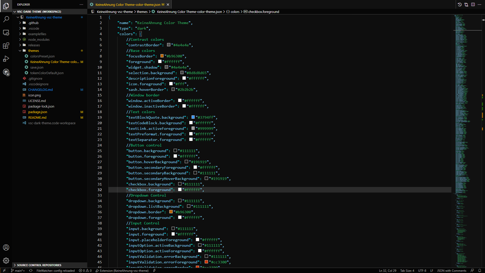

# Dark Color Theme of KeineAhnung

    

A dark theme for Visual Studio Code.

## Supported Languages

- CSS
- HTML
- JavaScript
- JSON
- Markdown
- Python

## Preview

</img>

## Links
- [Github Repository](https://github.com/TheKeineAhnung/VSC-theme)
- [Report a Bug](https://github.com/TheKeineAhnung/VSC-theme/issues/new)
- [Templates](https://github.com/TheKeineAhnung/VSC-theme/tree/main/.github/ISSUE_TEMPLATES)

[previewPic]: images/Theme_Preview.png