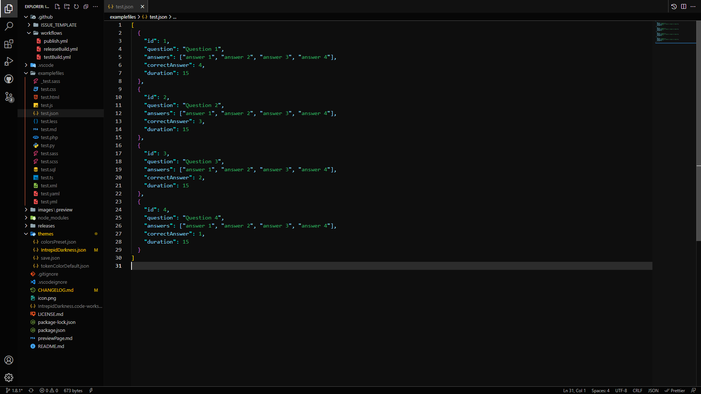

# Dark Color Theme of KeineAhnung

     

A dark theme for Visual Studio Code.

## Supported Languages

- CSS
    - Sass
    - SCSS
- HTML
- JavaScript
- JSON
- Markdown
- Python

## Preview

For a complete preview visit the [Preview Page]()

</img>

## Installation Guide

1. Open Extensions sidebar panel in Visual Studio Code.
2. Search for Intrepid Darkness.
3. Click Install.
4. Click Reload.
5. Code/File > Preferences ＞ Color Theme ＞ Intrepid Darkness.
6. Rate the theme.

## Links
- [Github Repository](https://github.com/TheKeineAhnung/VSC-theme)
- [Report a Bug](https://github.com/TheKeineAhnung/VSC-theme/issues/new)
- [Templates](https://github.com/TheKeineAhnung/VSC-theme/tree/main/.github/ISSUE_TEMPLATES)

[previewPic]: images/Theme_Preview.png

<a href="https://www.instagram.com/keineahnunggrafiken/">
    </img>
</a>
<a href="https://github.com/TheKeineAhnung/">
    </img>
</a>
<a>
    </img>
</a>